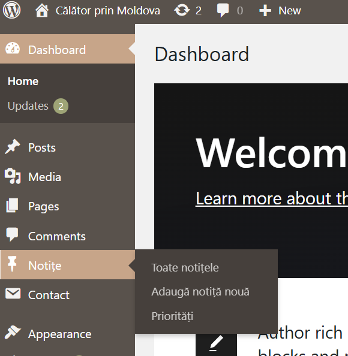
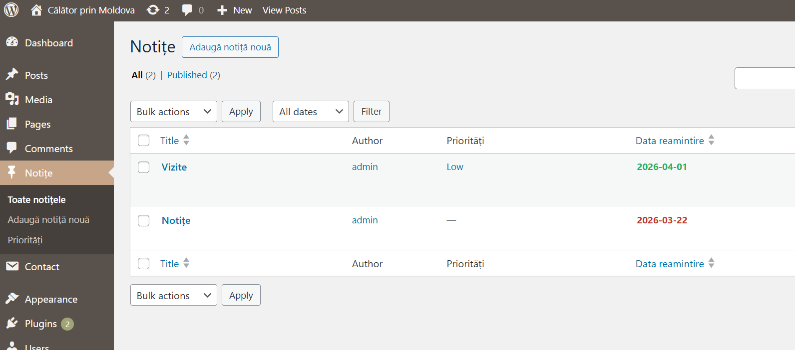
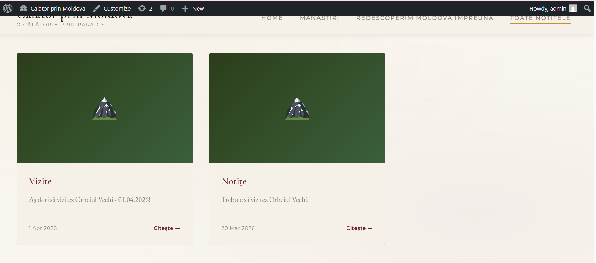
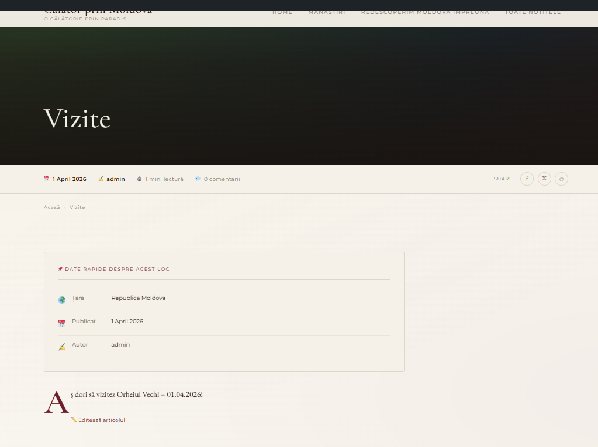

#  Dezvoltarea unui plugin pentru WordPress - Lucrarea de Laborator Nr. 4

**Student: Semeniuc Dănuța** 
**Grupa: I2301**   
**Profesor: Nartea Nichita, asist. univ** 

---

## 1. Scopul lucrării

Scopul acestei lucrări de laborator este de a studia modelul extensibil de date al WordPress prin crearea unui plugin complet care include:

- Un **Custom Post Type (CPT)** — tip de conținut personalizat;
- O **taxonomie personalizată** — sistem de clasificare;
- **Metadate cu metabox** — câmpuri suplimentare în panoul de administrare;
- Un **shortcode** — pentru afișarea datelor pe frontend;
- Gestionarea **securității** prin nonce și sanitizarea datelor.

---

## 2. Formularea sarcinii

Se cere crearea unui plugin educațional numit **USM Notes**, care adaugă pe site o secțiune „Notițe" cu următoarele funcționalități:

| Pas | Cerință |
|-----|---------|
| 1 | Pregătirea mediului (WordPress local + WP_DEBUG) |
| 2 | Fișierul principal al pluginului cu metadate |
| 3 | Înregistrare CPT „Notițe" cu `register_post_type()` |
| 4 | Înregistrare taxonomie „Prioritate" cu `register_taxonomy()` |
| 5 | Metabox pentru data de reamintire, cu validare și nonce |
| 6 | Shortcode `[usm_notes priority="X" before_date="YYYY-MM-DD"]` |
| 7 | Testarea cu notițe și pagina „All Notes" |

---

## 3. Partea teoretică

### 3.1 Custom Post Types (CPT)

Un **Custom Post Type** este un nou tip de conținut definit de dezvoltator, pe lângă tipurile standard `post` și `page`. CPT-urile sunt stocate în aceeași tabelă `wp_posts` din baza de date, dar cu o valoare diferită a câmpului `post_type`. Funcția `register_post_type()` înregistrează CPT-ul și îl face disponibil în interfața de administrare.

**Parametrii esențiali:**
- `public` — face CPT-ul vizibil pe frontend;
- `has_archive` — creează o pagină de arhivă pentru listarea tuturor postărilor;
- `supports` — specifică ce funcționalități WordPress sunt disponibile (titlu, editor, miniatură etc.);
- `labels` — etichetele afișate în panoul admin;
- `menu_icon` — pictograma Dashicons afișată în meniu.

### 3.2 Taxonomii personalizate

O **taxonomie personalizată** este un sistem de clasificare a conținutului. WordPress oferă implicit `category` (ierarhică) și `tag` (plată). Funcția `register_taxonomy()` permite crearea unor clasificatori proprii.

**Diferența cheie:**
- Taxonomie **ierarhică** (`hierarchical => true`) — se comportă ca și categoriile, permite subcategorii;
- Taxonomie **plată** (`hierarchical => false`) — se comportă ca și etichetele.

### 3.3 Metadate și Metabox

**Metadatele** (câmpurile personalizate) stochează informații suplimentare despre o postare în tabela `wp_postmeta`, sub forma perechilor `meta_key => meta_value`. API-ul WordPress oferă funcțiile `get_post_meta()`, `update_post_meta()` și `delete_post_meta()` pentru gestionarea lor.

**Metabox-ul** este un panou vizual în editorul WordPress, adăugat cu `add_meta_box()`, care oferă interfața pentru editarea metadatelor.

### 3.4 Mecanismul Hook-uri

**Hook-urile** sunt puncte de extensie în execuția WordPress:
- **Acțiuni** (`add_action`) — execută cod la un moment dat, fără a returna valori;
- **Filtre** (`add_filter`) — interceptează și modifică date, trebuie să returneze valoarea.

### 3.5 Shortcode-uri

Un **shortcode** este un macro `[tag atribute]` inserat în conținut, pe care WordPress îl înlocuiește cu HTML generat de o funcție PHP înregistrată cu `add_shortcode()`. Funcția handler trebuie să *returneze* (nu să afișeze cu `echo`) HTML-ul rezultat.

---

## 4. Implementarea

### 4.1 Structura pluginului

```
usm-notes/
├── usm-notes.php                  ← Fișierul principal (antet plugin)
├── includes/
│   └── class-usm-notes.php        ← Clasa principală (logică OOP)
└── assets/
    └── css/
        └── usm-notes.css          ← Stiluri frontend
```

Utilizarea abordării **OOP** (orientate pe obiecte) aduce avantaje clare față de abordarea procedurală: metode și proprietăți encapsulate în clasa `USM_Notes` reduc riscul de coliziuni cu alte pluginuri și fac codul mai ușor de întreținut și extins.

---

### 4.2 Fișierul principal (`usm-notes.php`)

```php
<?php
/**
 * Plugin Name: USM Notes
 * Description: Adaugă o secțiune „Notițe" cu priorități și o dată de reamintire.
 * Version:     1.0.0
 * Author:      Student USM
 * Text Domain: usm-notes
 */

if ( ! defined( 'ABSPATH' ) ) {
    exit;
}

define( 'USM_NOTES_VERSION', '1.0.0' );
define( 'USM_NOTES_DIR', plugin_dir_path( __FILE__ ) );
define( 'USM_NOTES_URL', plugin_dir_url( __FILE__ ) );

require_once USM_NOTES_DIR . 'includes/class-usm-notes.php';

function usm_notes_init() {
    $plugin = new USM_Notes();
    $plugin->init();
}
add_action( 'plugins_loaded', 'usm_notes_init' );
```

**Observații de implementare:**
- Verificarea `ABSPATH` previne accesul direct la fișier din browser;
- Constantele `USM_NOTES_DIR` / `USM_NOTES_URL` facilitează referințele la fișiere din plugin;
- Hook-ul `plugins_loaded` garantează că toate pluginurile sunt încărcate înainte de inițializare.

---

### 4.3 Înregistrarea CPT (Pasul 3)

```php
public function register_post_type() {
    $labels = [
        'name'          => __( 'Notițe', 'usm-notes' ),
        'singular_name' => __( 'Notiță', 'usm-notes' ),
        'add_new'       => __( 'Adaugă notiță', 'usm-notes' ),
        // ...
    ];

    $args = [
        'labels'       => $labels,
        'public'       => true,
        'has_archive'  => true,
        'menu_icon'    => 'dashicons-sticky',
        'supports'     => [ 'title', 'editor', 'author', 'thumbnail' ],
        'rewrite'      => [ 'slug' => 'notes' ],
        'show_in_rest' => true,
    ];

    register_post_type( 'note', $args );
}
```

Parametrul `show_in_rest => true` asigură compatibilitatea cu editorul Gutenberg și cu REST API-ul WordPress.

---

### 4.4 Înregistrarea taxonomiei (Pasul 4)

```php
public function register_taxonomy() {
    $args = [
        'labels'            => [ /* ... */ ],
        'hierarchical'      => true,   // Ca și categoriile
        'public'            => true,
        'show_admin_column' => true,   // Coloană în lista admin
        'rewrite'           => [ 'slug' => 'priority' ],
        'show_in_rest'      => true,
    ];

    register_taxonomy( 'priority', [ 'note' ], $args );
}
```

Taxonomia este asociată exclusiv tipului `note` și este **ierarhică**, permițând organizarea în arbore (ex: `Urgent > High`, `Low > Opțional`).

---

### 4.5 Metabox cu validare și nonce (Pasul 5)

Aceasta a fost cea mai complexă parte a implementării. Fluxul de salvare include mai multe niveluri de validare:

```
Utilizator salvează postarea
         │
         ▼
   Verificare nonce ──── EȘUAT ──→ return (ignorat silențios)
         │
         ▼
   Este autosave? ──── DA ──→ return
         │
         ▼
   Are permisiuni? ──── NU ──→ return
         │
         ▼
   Câmpul e gol? ──── DA ──→ set_transient('eroare') → revine la ciornă
         │
         ▼
   Data e în trecut? ── DA ──→ set_transient('eroare') → revine la ciornă
         │
         ▼
   update_post_meta() → salvare reușită
```

**Mecanism de afișare a erorilor:** Am utilizat `set_transient()` pentru a transmite mesajul de eroare de la hook-ul `save_post` către hook-ul `admin_notices`, deoarece cele două se execută în cereri HTTP diferite (salvarea face redirect). Durata tranzitorului este de 30 de secunde.

**Câmpul HTML pentru dată:**
```html
<input
    type="date"
    name="usm_note_due_date"
    min="<?php echo esc_attr( date('Y-m-d') ); ?>"
    required
/>
```
Atributul `min` restricționează selectarea datelor trecute direct din interfața browser-ului, ca primă linie de apărare. Validarea server-side rămâne esențială pentru securitate.

---

### 4.6 Coloană personalizată în lista admin

Am adăugat coloana „Data reamintire" în lista postărilor CPT, cu cod de culoare:

- **Roșu** — data a trecut (notița a expirat);
- **Verde** — data este în viitor.

```php
public function render_due_date_column( $column, $post_id ) {
    if ( $column === 'usm_due_date' ) {
        $due_date = get_post_meta( $post_id, '_usm_note_due_date', true );
        $is_past  = $due_date < date( 'Y-m-d' );
        $color    = $is_past ? '#c0392b' : '#27ae60';
        echo '<span style="color:' . esc_attr( $color ) . ';font-weight:bold;">';
        echo esc_html( $due_date );
        echo '</span>';
    }
}
```

---

### 4.7 Shortcode `[usm_notes]` (Pasul 6)

Shortcode-ul acceptă doi parametri opționali:

| Parametru | Tip | Descriere |
|-----------|-----|-----------|
| `priority` | string | Slug-ul taxonomiei (ex: `high`, `medium`, `low`) |
| `before_date` | string | Format `YYYY-MM-DD` — afișează notițe cu data ≤ valoarea dată |

**Logica de filtrare folosind `WP_Query`:**

```php
// Filtru după taxonomie (priority)
if ( ! empty( $atts['priority'] ) ) {
    $args['tax_query'] = [[
        'taxonomy' => 'priority',
        'field'    => 'slug',
        'terms'    => $atts['priority'],
    ]];
}

// Filtru după dată
if ( ! empty( $atts['before_date'] ) ) {
    $args['meta_query'] = [[
        'key'     => '_usm_note_due_date',
        'value'   => $atts['before_date'],
        'compare' => '<=',
        'type'    => 'DATE',
    ]];
}
```

Rezultatele sunt ordonate crescător după data de reamintire (`orderby => meta_value`), ceea ce pune notițele urgente în față.

---

### 4.8 Stiluri CSS

Am implementat un sistem de carduri responsive cu grid CSS, cu accent vizual lateral (`border-left`) colorat în funcție de prioritate:

| Prioritate | Culoare |
|------------|---------|
| `high` | Roșu `#e74c3c` |
| `medium` | Portocaliu `#f39c12` |
| `low` | Verde `#27ae60` |

Layout-ul folosește `grid-template-columns: repeat(auto-fill, minmax(300px, 1fr))` pentru adaptare automată la orice lățime de ecran.

---

## 5. Testarea pluginului


Pluginul apare in Dashboard:



Putem vizualiza toate notițele, să adăugăm notițe și să punem priorități:



Modul de afișare:




---

## 6. Răspunsuri la întrebările de control

### Întrebarea 1
**Care este diferența esențială dintre o taxonomie personalizată și un metacâmp? Oferă un exemplu când este mai potrivit să folosești taxonomie și când metadate.**

**Taxonomia** este un sistem de clasificare a conținutului în termeni discreți (categorii), optimizat pentru filtrare și navigare. Termenii sunt stocați în tabela `wp_terms` și au URL-uri proprii, pagini de arhivă și pot fi afișați ca facete de filtrare.

**Metacâmpul** este o pereche arbitrară cheie-valoare asociată unei postări, stocată în `wp_postmeta`. Este potrivit pentru informații scalare, specifice fiecărei postări.

**Exemplu — când să folosești taxonomie:**  
Un site de rețete are categoria „Vegetarian" / „Vegan" / „Cu carne". Aceste valori sunt reutilizate de sute de postări, iar utilizatorii vor naviga pe pagina `site.com/categorie/vegetarian/` pentru a vedea toate rețetele dintr-o categorie. Filtrarea eficientă în WP_Query se face cu `tax_query`.

**Exemplu — când să folosești metadate:**  
Același site stochează „Timpul de preparare" (ex: 45 minute) pentru fiecare rețetă. Această valoare este unică per postare, numerică, și se folosește pentru filtrare sau afișare individuală (`meta_query` sau `get_post_meta()`). Nu are sens să fie o taxonomie, deoarece nu clasifică conținutul în categorii reutilizabile.

**Regula simplă:**
- Valori cu cardinalitate mică, reutilizabile, pentru navigare → **taxonomie**
- Valori unice, scalare, specifice fiecărei postări → **metacâmpuri**

---

### Întrebarea 2
**De ce este necesar nonce la salvarea metacâmpurilor și ce se întâmplă dacă nu este verificat?**

**Nonce** (Number Used Once) este un token de securitate generat de WordPress, unic pentru o acțiune specifică și un utilizator specific, cu durată de viață limitată (24 de ore implicit).

**De ce este necesar:**  
Fără verificarea nonce-ului, pluginul este vulnerabil la atacuri de tip **CSRF (Cross-Site Request Forgery)**. Un site malițios ar putea construi un formular HTML care trimite o cerere POST către site-ul victimă (cu cookie-urile de sesiune ale administratorului autentificat), modificând metadatele oricărei postări.

**Fluxul nonce:**
```php
// La generarea formularului (randare metabox):
wp_nonce_field( 'usm_save_note_due_date', 'usm_note_due_date_nonce' );
// → generează <input type="hidden" name="usm_note_due_date_nonce" value="abc123">

// La salvare (hook save_post):
if ( ! wp_verify_nonce( $_POST['usm_note_due_date_nonce'], 'usm_save_note_due_date' ) ) {
    return; // Cerere neautentică sau expirată → ignorăm
}
```

**Consecințe dacă nonce-ul nu este verificat:**
1. Orice site extern poate falsifica cereri de salvare;
2. Un atacator poate modifica datele postărilor fără știrea administratorului;
3. Plugin-ul poate fi exploatat pentru injectarea de date malițioase în baza de date.

---

### Întrebarea 3
**Care sunt cei mai importanți parametri ai `register_post_type()` și `register_taxonomy()` pentru frontend și UX? (cel puțin trei, cu explicații)**

#### Pentru `register_post_type()`:

**1. `public => true`**  
Activează vizibilitatea CPT-ului pe frontend. Dacă este `false`, postările nu sunt accesibile pe site, nu există URL-uri individuale și nu apare în rezultatele căutării. Pentru UX: utilizatorii pot accesa pagini individuale ale postărilor.

**2. `has_archive => true`**  
Creează o pagină de arhivă la slug-ul CPT-ului (ex: `site.com/notes/`), care listează toate postările publicate. Fără aceasta, utilizatorii nu pot naviga la o listă a tuturor postărilor de acest tip. Esențial pentru UX — oferă un punct de intrare în secțiunea „Notițe".

**3. `rewrite => [ 'slug' => 'notes' ]`**  
Definește structura URL-urilor pentru postări individuale (ex: `site.com/notes/titlul-notitei/`). URL-uri clare și descriptive îmbunătățesc UX-ul și SEO-ul. Fără aceasta, WordPress generează URL-uri mai puțin prietenoase.

**4. `supports => [ 'thumbnail' ]` (bonus)**  
Activează câmpul „Imagine reprezentativă" în editor. Aceasta permite afișarea unei imagini de previzualizare în listele de notițe, îmbunătățind considerabil aspectul vizual.

#### Pentru `register_taxonomy()`:

**1. `hierarchical => true`**  
Face taxonomia să se comporte ca și categoriile (cu subcategorii), spre deosebire de etichete (plate). Pentru UX: administratorul poate organiza prioritățile ierarhic, iar în editorul postării apare o listă de checkbox-uri în loc de un câmp text liber.

**2. `show_admin_column => true`**  
Adaugă automat o coloană în lista postărilor CPT, afișând termenul taxonomiei pentru fiecare postare. Pentru UX administrativ: administratorul vede prioritatea fiecărei notițe direct din lista postărilor, fără a deschide fiecare postare individual.

**3. `rewrite => [ 'slug' => 'priority' ]`**  
Definește URL-ul paginilor de arhivă ale taxonomiei (ex: `site.com/priority/high/`). Permite utilizatorilor să navigheze direct la toate notițele cu o anumită prioritate printr-un URL clar și intuitiv.

---

## 7. Concluzie

Prin realizarea acestei lucrări de laborator, am dobândit cunoștințe practice despre arhitectura extensibilă a WordPress:

1. **Custom Post Types** permit definirea de noi tipuri de conținut adaptate nevoilor specifice ale proiectului, fără a modifica nucleul WordPress.

2. **Taxonomiile personalizate** oferă sisteme flexibile de clasificare, cu avantaje față de metacâmpuri atunci când valorile sunt reutilizabile și navigabile.

3. **Metabox-ul cu validare** demonstrează importanța validării pe mai multe niveluri: HTML5 (atribut `min`, `required`), PHP (verificare dată în trecut), și securitate (nonce CSRF).

4. **Abordarea OOP** cu clasa `USM_Notes` reduce conflictele de spațiu de nume față de funcțiile globale și face codul mai modular și mai ușor de testat.

5. **Shortcode-ul** cu `WP_Query` și parametrii `tax_query` / `meta_query` demonstrează puterea API-ului WordPress pentru interogări complexe fără SQL direct.

**Repository Git:** [https://github.com/danutasemeniuc/Lab4_CMS]([https://github.com/danutasemeniuc/Lab4_CMS])

---

## 8. Surse utilizate

1. WordPress Developer — *Custom Post Types*. Disponibil la: https://developer.wordpress.org/plugins/post-types/
2. WordPress Developer — *Taxonomies*. Disponibil la: https://developer.wordpress.org/plugins/taxonomies/
3. WordPress Developer — *Metadata API*. Disponibil la: https://developer.wordpress.org/plugins/metadata/
4. WordPress Developer — *Shortcodes*. Disponibil la: https://developer.wordpress.org/plugins/shortcodes/
5. WordPress Developer — *Hooks (Actions & Filters)*. Disponibil la: https://developer.wordpress.org/reference/hooks/
6. WordPress Developer — *Nonces*. Disponibil la: https://developer.wordpress.org/apis/security/nonces/
7. WP Beginner — *register_post_type() Function Reference*. Disponibil la: https://www.wpbeginner.com/glossary/custom-post-types/
8. Kinsta — *WordPress User Roles and Capabilities*. Disponibil la: https://kinsta.com/blog/wordpress-user-roles/
9. Manualul cursului — *Sistemele de Gestionare a Conținutului*, Capitolele 7–9.
